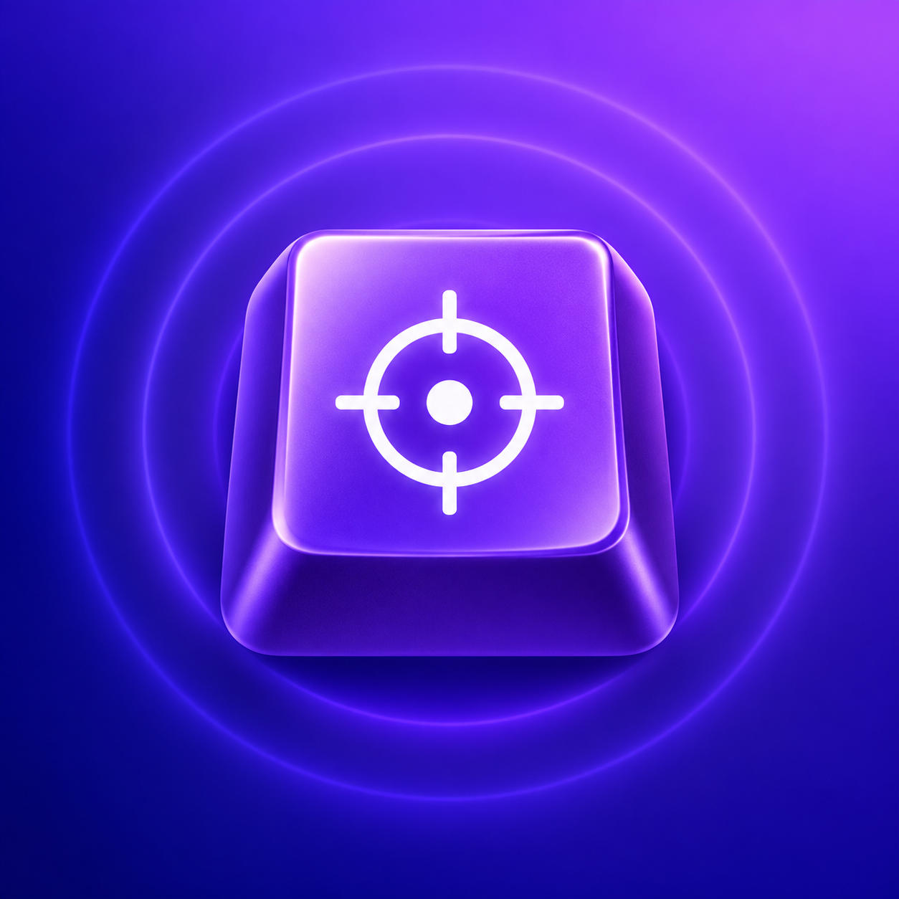
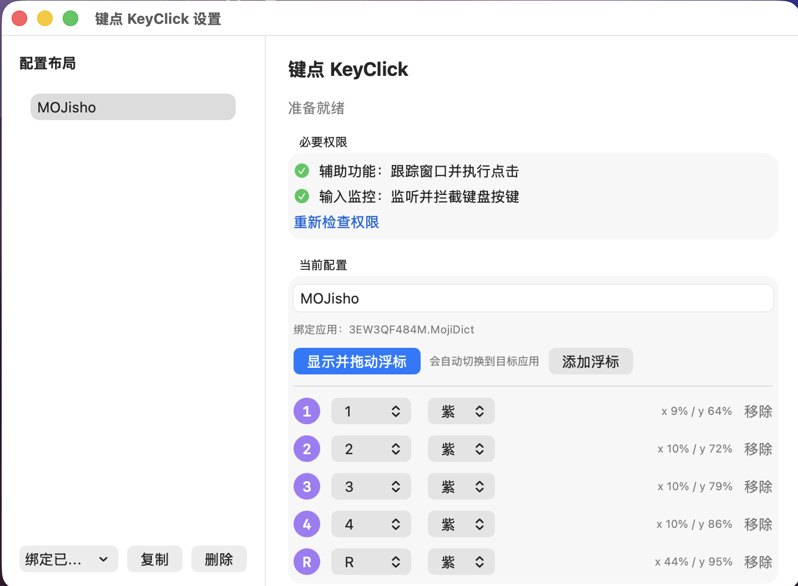
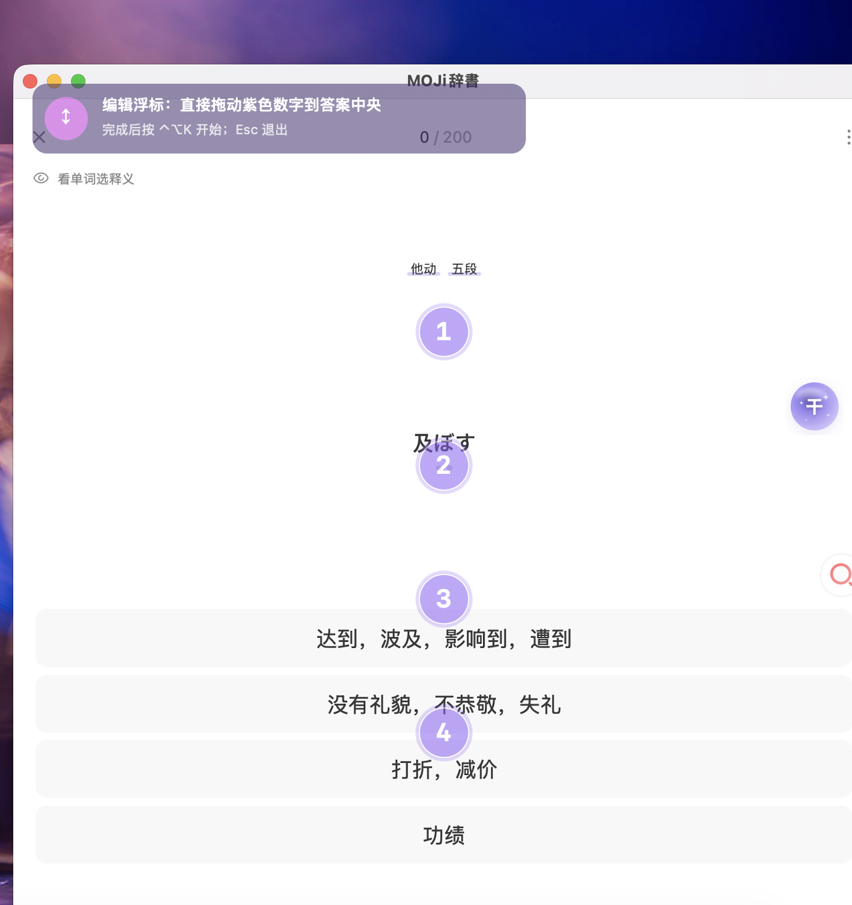
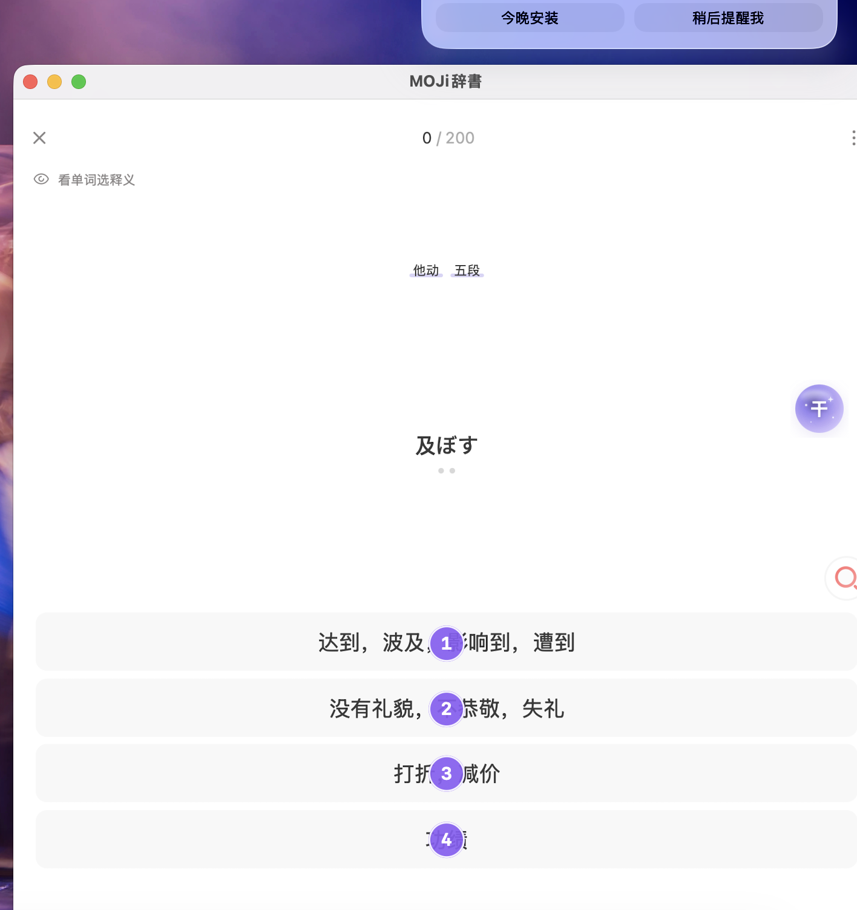
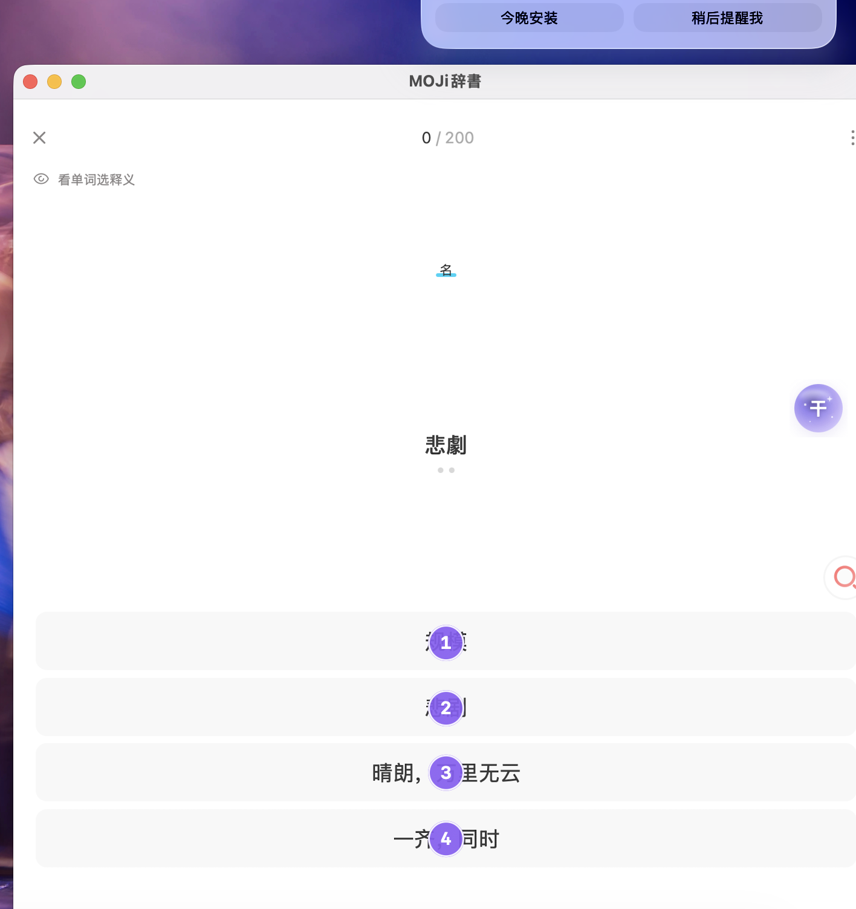

# 键点 KeyClick

<p align="center">
  
</p>

<p align="center"><strong>把键盘按键，映射为当前 macOS 窗口中的一次真实点击。</strong></p>

KeyClick 是离线原生 macOS 工具。给某个应用的按钮放置可拖动浮标；进入点击模式后，按 `1`、`A`、`Space` 或功能键，即在该浮标中心发送**一次**左键点击。它适合有重复选择操作的学习、训练或自用桌面软件；不包含连点、宏、OCR、图像识别、右键或双击。

- macOS 14+，Universal 2（Apple Silicon + Intel）
- 无账号、无联网依赖；布局只保存在本机
- 普通应用窗口 + Dock 图标，不会找不到设置窗口
- 一套配置绑定一个应用；同一应用可以保存、切换多套布局

## 下载与安装

从 [Releases](../../releases/latest) 下载 `KeyClick-macOS-universal-v1.1.4.zip`，解压后把 `KeyClick.app` 拖入“应用程序”。首次启动在系统设置中打开：

1. **辅助功能**：跟踪目标窗口，并在浮标中心单击；
2. **输入监控**：在点击模式监听映射键，并仅吞掉已映射按键。

如果 macOS 设置页已经打开开关、但 KeyClick 仍把状态显示为未确认，可在“必要权限”区点击 **“状态不正确？仍然尝试使用”**。它不会伪造绿色授权状态，而是启用兼容窗口定位与键盘监听路径，直接尝试显示浮标和点击；兼容键盘监听无法吞掉映射键时，按键仍可能同时传给目标应用。

源码构建：

```zsh
./test.sh
./build.sh
./install.sh # 安装到 /Applications，并创建桌面替身
```

## 真实使用界面

以下是实机捕获并裁切后的界面，不是示意图。截图仅保留 KeyClick 与测试中的 MOJisho 窗口。

### 1. 权限就绪与布局编辑



在“显示并拖动浮标”中，目标应用会自动来到前台。紫色浮标可直接拖到每个选项中心；点“完成编辑”或按 `Esc` 都会结束编辑、回到目标窗口待机状态。

### 2. 编辑态：把 1–4 放到四个答案上



### 3. 点击模式与一次触发结果

| 开启点击模式 | 按下 `1` 后 |
| --- | --- |
|  |  |

实测中，按 `1` 后 MOJisho 从题目“及ぼす”切换到下一题“悲劇”。点击模式不接管鼠标，未映射的按键会正常传给目标应用；长按映射键只触发一次。

## 使用流程

1. 让目标应用的窗口处于前台，选择“绑定当前前台窗口”。
2. 点击“显示并拖动浮标”，将默认 `1–4` 放到要点击的位置；可添加、删除或换键。
3. 点击“完成编辑”。
4. 按 `⌃⌥K` 进入/退出点击模式；按 `Esc` 随时退出。
5. 保持目标窗口前台，按已分配的键即可单击。切换应用、最小化/关闭目标窗口或打开 KeyClick 设置时，模式会自动退出，避免误点。

### 可选键位

默认顺序为 `1–9`、`A–Z`。也可以把单个浮标换为 `Space`、`Return`、`Tab`、`Delete`、方向键或 `F1–F12`；`Esc` 和修饰键被保留作退出/系统快捷键，不能分配。数字小键盘同样可触发对应数字。

## 数据、隐私与边界

- 配置：`~/Library/Application Support/KeyClick/config.json`，原子写入；损坏文件会备份为 `config-corrupt-<timestamp>.json`。
- 无屏幕录制权限请求；不上传截图、按键或布局数据。
- 窗口坐标按内容区域比例保存，会随移动、缩放、全屏和跨显示器变换。
- 仅单次左键点击。不承诺游戏、安全输入框或拒绝合成事件的软件兼容。

## 验证

```zsh
./test.sh                    # Swift 单元测试 + 16 条核心断言
./run-harness.sh             # 本地四按钮交互测试靶场
./build.sh                   # Universal 2 .app + plist/签名检查
codesign --verify --deep --strict dist/KeyClick.app
lipo -archs dist/KeyClick.app/Contents/MacOS/KeyClick
```

发布镜像同时提供在 [GitHub Packages (GHCR)](https://ghcr.io/lyyrebecca/keyclick)。

## 许可证

[MIT](LICENSE)
